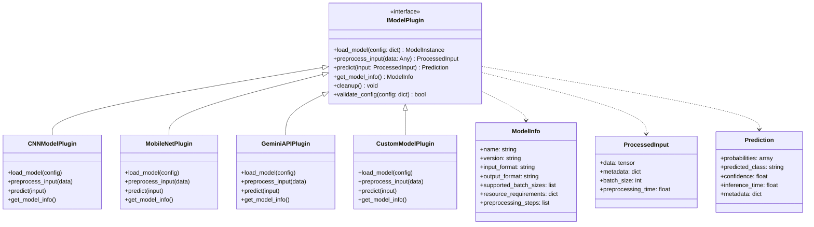
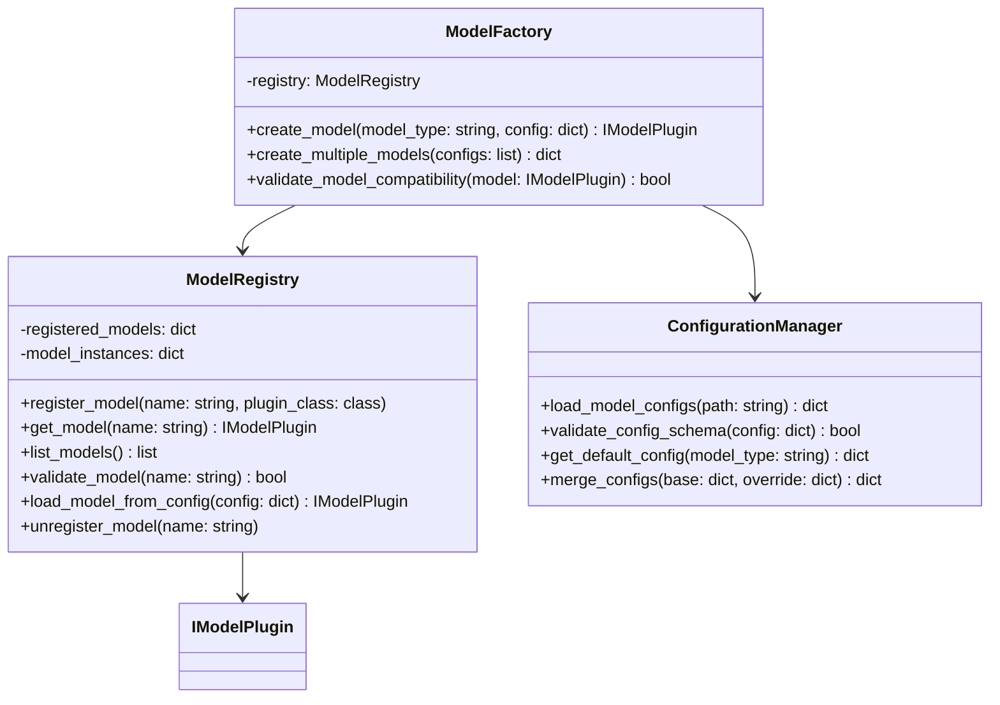
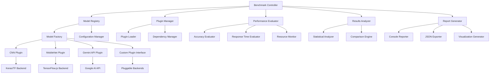
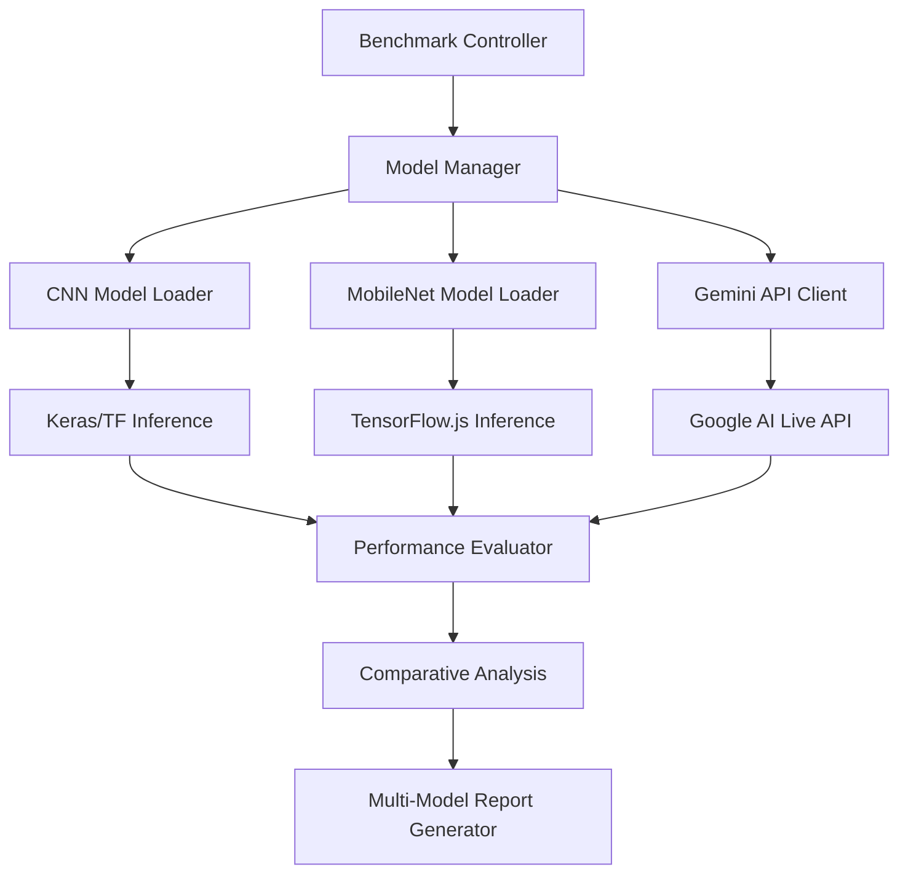
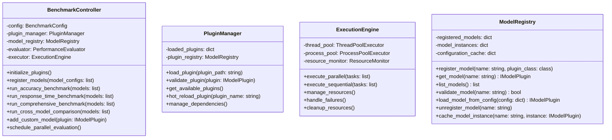
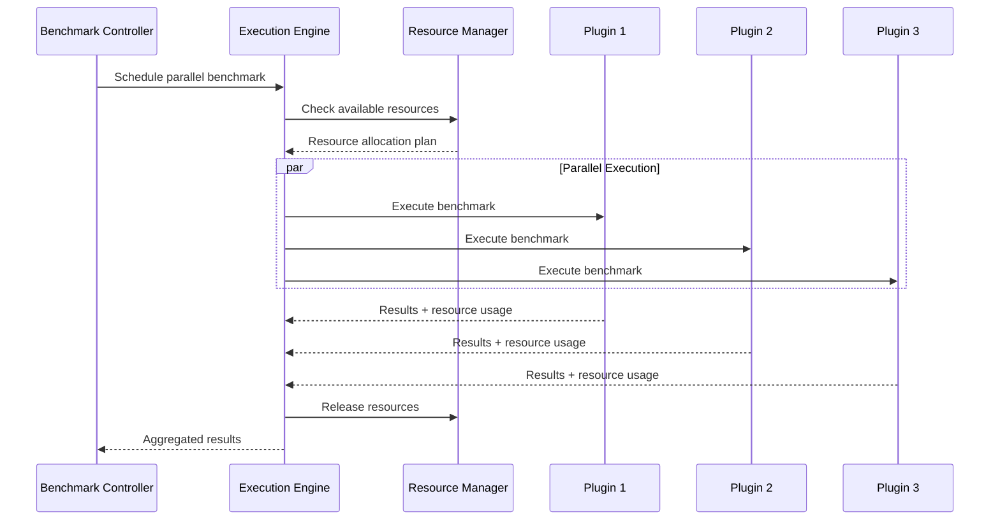

# SketchRNN Model Benchmarking System Design

## Overview

The SketchRNN Benchmarking System is designed to comprehensively evaluate the performance of trained CNN models on the QuickDraw dataset. This system measures both prediction accuracy and inference response time across all 28 drawing categories, providing detailed performance metrics and comparative analysis capabilities.

The benchmark addresses the critical need for systematic model evaluation in production environments, ensuring models meet performance requirements before deployment and enabling continuous performance monitoring.

## Technology Stack & Dependencies

### Core Dependencies
- **TensorFlow/Keras**: Model loading and inference
- **NumPy**: Numerical computations and array operations  
- **Scikit-learn**: Evaluation metrics and data splitting
- **Matplotlib/Seaborn**: Visualization and reporting
- **PIL (Pillow)**: Image preprocessing
- **Time**: Performance timing measurements
- **Threading**: Thread-safe resource management
- **JSON**: Configuration and results serialization

### Data Dependencies
- QuickDraw dataset (28×28 grayscale images, 28 categories)
- Trained model weights (.h5 files)
- Category definitions (categories.json)

#### Supported Categories
The benchmark system evaluates performance across 28 distinct drawing categories based on the actual implementation:

**Animals:**
cat, dog, elephant, giraffe, lion, tiger, bear, bird, fish

**Food & Consumables:**
apple, banana, grapes, strawberry, pizza, hamburger, hot dog, ice cream, cake

**Transportation:**
airplane, train, bicycle, helicopter, car

**Nature & Environment:**
house, tree, flower, sun, moon

Note: This matches the actual categories.json implementation with 28 categories total.

## Modular Plugin Architecture

### Design Principles

#### 1. Extensibility
- **Plugin-Based System**: New models can be added without modifying core benchmarking logic
- **Interface Standardization**: All models implement common interfaces for consistent integration
- **Configuration-Driven**: Model registration and parameters managed through configuration files
- **Hot-Pluggable**: Dynamic model loading and registration at runtime

#### 2. Scalability
- **Horizontal Scaling**: Support for distributed benchmarking across multiple processes/machines
- **Parallel Execution**: Concurrent model evaluation with resource management
- **Memory Optimization**: Lazy loading and memory-efficient model management
- **Batch Processing**: Configurable batch sizes and processing strategies

#### 3. Maintainability
- **Separation of Concerns**: Clear boundaries between core logic and model-specific implementations
- **Dependency Injection**: Loose coupling through dependency injection patterns
- **Error Isolation**: Model failures don't affect other model evaluations
- **Comprehensive Logging**: Detailed logging for debugging and monitoring

### Abstract Model Interface



### Plugin Registry System



### Dynamic Model Loading

#### Universal Model Registration System
```python
# Generic registration decorator that works with any model type
@register_model("model_name")
class AnyModelPlugin(IModelPlugin):
    def load_model(self, config):
        # Universal model loading logic
        pass
    
    def preprocess_input(self, data):
        # Model-specific preprocessing
        pass
    
    def predict(self, input):
        # Model-specific inference
        pass
    
    def get_model_info(self):
        return ModelInfo(
            name="any_model_type",
            version="1.0.0",
            input_format="flexible",
            output_format="classification_probabilities"
        )
```

#### Generic Model Factory
```python
class UniversalModelFactory:
    def __init__(self):
        self.supported_formats = {
            '.h5': self._load_keras_model,
            '.pb': self._load_tensorflow_model,
            '.onnx': self._load_onnx_model,
            '.pkl': self._load_pickle_model,
            '.pth': self._load_pytorch_model,
            '.safetensors': self._load_safetensors_model,
            '.json': self._load_tfjs_model
        }
        
    def create_plugin_from_file(self, model_path: str, config: Dict[str, Any]) -> IModelPlugin:
        """
        Automatically detect model type and create appropriate plugin
        """
        # Validate file existence and accessibility
        if not os.path.exists(model_path):
            raise FileNotFoundError(f"Model file not found: {model_path}")
        
        if not os.access(model_path, os.R_OK):
            raise PermissionError(f"Cannot read model file: {model_path}")
        
        file_extension = os.path.splitext(model_path)[1].lower()
        
        if file_extension not in self.supported_formats:
            raise ValueError(f"Unsupported model format: {file_extension}")
        
        try:
            # Load model using appropriate loader
            model = self.supported_formats[file_extension](model_path)
        except Exception as e:
            raise RuntimeError(f"Failed to load model from {model_path}: {str(e)}")
        
        # Determine model architecture type
        architecture_type = self._detect_architecture(model, config)
        
        # Create appropriate plugin
        return self._create_plugin_for_architecture(architecture_type, model, config)
    
    def _detect_architecture(self, model, config: Dict[str, Any]) -> str:
        """
        Auto-detect model architecture type
        """
        # Check config first for explicit architecture specification
        if 'architecture_type' in config:
            return config['architecture_type']
        
        # Auto-detection logic based on model structure
        if hasattr(model, 'layers'):
            layer_types = [type(layer).__name__ for layer in model.layers]
            
            # CNN detection
            if any('Conv' in layer_type for layer_type in layer_types):
                if any('Attention' in layer_type for layer_type in layer_types):
                    return 'cnn_with_attention'
                else:
                    return 'cnn'
            
            # Transformer detection
            elif any('Attention' in layer_type or 'MultiHead' in layer_type for layer_type in layer_types):
                return 'transformer'
            
            # RNN detection
            elif any('LSTM' in layer_type or 'GRU' in layer_type or 'RNN' in layer_type for layer_type in layer_types):
                return 'rnn'
            
            # Dense/MLP detection
            elif all('Dense' in layer_type or 'Dropout' in layer_type for layer_type in layer_types):
                return 'mlp'
        
        # Default fallback
        return 'generic'
    
    def _create_plugin_for_architecture(self, architecture_type: str, model, config: Dict[str, Any]) -> IModelPlugin:
        """
        Create appropriate plugin based on detected architecture
        """
        plugin_classes = {
            'cnn': CNNModelPlugin,
            'transformer': TransformerModelPlugin,
            'rnn': RNNModelPlugin,
            'mlp': MLPModelPlugin,
            'cnn_with_attention': CNNAttentionModelPlugin,
            'generic': GenericModelPlugin
        }
        
        plugin_class = plugin_classes.get(architecture_type, GenericModelPlugin)
        plugin = plugin_class()
        
        # Pre-load the model into the plugin
        plugin.model = model
        plugin.config = config
        
        return plugin
    
    def _load_keras_model(self, model_path: str):
        """Load Keras/TensorFlow .h5 model"""
        import tensorflow as tf
        return tf.keras.models.load_model(model_path)
    
    def _load_tensorflow_model(self, model_path: str):
        """Load TensorFlow SavedModel (.pb)"""
        import tensorflow as tf
        return tf.saved_model.load(model_path)
    
    def _load_onnx_model(self, model_path: str):
        """Load ONNX model"""
        try:
            import onnxruntime as ort
            return ort.InferenceSession(model_path)
        except ImportError:
            raise ImportError("onnxruntime required for ONNX models")
    
    def _load_pickle_model(self, model_path: str):
        """Load pickled model (scikit-learn, custom models)"""
        import pickle
        with open(model_path, 'rb') as f:
            return pickle.load(f)
    
    def _load_pytorch_model(self, model_path: str):
        """Load PyTorch model"""
        try:
            import torch
            return torch.load(model_path, map_location='cpu')
        except ImportError:
            raise ImportError("torch required for PyTorch models")
    
    def _load_safetensors_model(self, model_path: str):
        """Load SafeTensors model"""
        try:
            from safetensors import safe_open
            return safe_open(model_path, framework="tf")
        except ImportError:
            raise ImportError("safetensors required for SafeTensors models")
    
    def _load_tfjs_model(self, model_path: str):
        """Load TensorFlow.js model"""
        import tensorflow as tf
        return tf.keras.models.load_model(model_path)
```

#### Enhanced Plugin Templates

**Generic Model Plugin (Base for all architectures)**
```python
class GenericModelPlugin(IModelPlugin):
    """Universal plugin that can handle any model architecture"""
    
    def __init__(self):
        self.model = None
        self.config = None
        self.preprocessing_pipeline = None
        
    def load_model(self, config: Dict[str, Any]):
        """Load model using universal factory"""
        if self.model is None:  # Not pre-loaded by factory
            factory = UniversalModelFactory()
            self.model = factory.create_plugin_from_file(
                config['model_path'], config
            ).model
        
        self.config = config
        self._setup_preprocessing(config)
        return self.model
    
    def _setup_preprocessing(self, config: Dict[str, Any]):
        """Setup preprocessing pipeline based on model requirements"""
        input_format = config.get('input_format', 'auto')
        
        if input_format == 'auto':
            # Auto-detect based on model input shape
            input_shape = self._get_model_input_shape()
            if len(input_shape) == 4:  # (batch, height, width, channels)
                self.preprocessing_pipeline = ImagePreprocessor(input_shape[1:3])
            elif len(input_shape) == 2:  # (batch, features)
                self.preprocessing_pipeline = FlattenPreprocessor()
            elif len(input_shape) == 3:  # (batch, sequence, features)
                self.preprocessing_pipeline = SequencePreprocessor()
        else:
            # Use specified preprocessing
            self.preprocessing_pipeline = self._create_preprocessor(input_format)
    
    def _get_model_input_shape(self):
        """Extract input shape from model"""
        if hasattr(self.model, 'input_shape'):
            return self.model.input_shape
        elif hasattr(self.model, 'inputs'):
            return self.model.inputs[0].shape
        else:
            return (None, 224, 224, 3)  # Default fallback
    
    def preprocess_input(self, data: Any) -> ProcessedInput:
        """Generic preprocessing using detected pipeline"""
        start_time = time.time()
        
        processed_data = self.preprocessing_pipeline.process(data)
        preprocessing_time = time.time() - start_time
        
        return ProcessedInput(
            data=processed_data,
            metadata={'preprocessing_type': type(self.preprocessing_pipeline).__name__},
            batch_size=len(processed_data) if hasattr(processed_data, '__len__') else 1,
            preprocessing_time=preprocessing_time
        )
    
    def predict(self, input_data: ProcessedInput) -> Prediction:
        """Generic prediction that works with any model"""
        start_time = time.time()
        
        # Handle different model types
        if hasattr(self.model, 'predict'):  # Keras/TensorFlow
            probabilities = self.model.predict(input_data.data, verbose=0)
        elif hasattr(self.model, '__call__'):  # PyTorch or callable
            probabilities = self.model(input_data.data)
            if hasattr(probabilities, 'numpy'):
                probabilities = probabilities.numpy()
        else:  # ONNX or other formats
            probabilities = self._run_inference(input_data.data)
        
        inference_time = time.time() - start_time
        
        # Handle output format
        if len(probabilities.shape) > 1 and probabilities.shape[0] == 1:
            probabilities = probabilities[0]
        
        predicted_class_idx = np.argmax(probabilities)
        confidence = float(np.max(probabilities))
        
        return Prediction(
            probabilities=probabilities,
            predicted_class=str(predicted_class_idx),
            confidence=confidence,
            inference_time=inference_time,
            metadata={'model_type': 'generic'}
        )
    
    def _run_inference(self, input_data):
        """
        Handle inference for non-standard model formats (ONNX, custom models)
        """
        try:
            # ONNX Runtime inference
            if hasattr(self.model, 'run'):
                input_name = self.model.get_inputs()[0].name
                output_name = self.model.get_outputs()[0].name
                result = self.model.run([output_name], {input_name: input_data})
                return result[0]
            
            # Custom model inference
            elif hasattr(self.model, 'inference'):
                return self.model.inference(input_data)
            
            # Fallback: try direct call
            else:
                return self.model(input_data)
                
        except Exception as e:
            raise RuntimeError(f"Inference failed for model type {type(self.model)}: {str(e)}")
    
    def get_model_info(self) -> ModelInfo:
        """Generate model info based on detected characteristics"""
        input_shape = self._get_model_input_shape()
        
        return ModelInfo(
            name=f"generic_model_{self.config.get('name', 'unknown')}",
            version="1.0.0",
            input_format=f"shape_{input_shape}",
            output_format="classification_probabilities",
            supported_batch_sizes=[1, 8, 16, 32],
            resource_requirements={
                'memory_mb': 512,
                'gpu_required': False,
                'cpu_cores': 1
            },
            preprocessing_steps=["auto_detected"]
        )
```

**Specialized Architecture Plugins**
```python
class CNNModelPlugin(GenericModelPlugin):
    """Specialized plugin for CNN architectures"""
    
    def get_model_info(self) -> ModelInfo:
        return ModelInfo(
            name=f"cnn_model_{self.config.get('name', 'unknown')}",
            version="1.0.0",
            input_format="image_tensor",
            output_format="classification_probabilities",
            supported_batch_sizes=[1, 16, 32, 64],
            resource_requirements={
                'memory_mb': 256,
                'gpu_required': False,
                'cpu_cores': 1
            },
            preprocessing_steps=["resize", "normalize", "convert_to_tensor"]
        )

class TransformerModelPlugin(GenericModelPlugin):
    """Specialized plugin for Transformer architectures"""
    
    def preprocess_input(self, data: Any) -> ProcessedInput:
        """Transformer-specific preprocessing"""
        start_time = time.time()
        
        # Handle text tokenization or image patches
        if isinstance(data, str):
            processed_data = self._tokenize_text(data)
        else:
            processed_data = self._create_patches(data)
        
        preprocessing_time = time.time() - start_time
        
        return ProcessedInput(
            data=processed_data,
            metadata={'preprocessing_type': 'transformer_specific'},
            batch_size=1,
            preprocessing_time=preprocessing_time
        )
    
    def get_model_info(self) -> ModelInfo:
        return ModelInfo(
            name=f"transformer_model_{self.config.get('name', 'unknown')}",
            version="1.0.0",
            input_format="sequence_tensor",
            output_format="classification_probabilities",
            supported_batch_sizes=[1, 8, 16],
            resource_requirements={
                'memory_mb': 1024,
                'gpu_required': True,
                'cpu_cores': 2
            },
            preprocessing_steps=["tokenize", "encode", "attention_mask"]
        )
```

#### Configuration-Based Model Definition
```json
{
  "model_plugins": {
    "custom_model": {
      "plugin_class": "custom_plugins.CustomModelPlugin",
      "config": {
        "model_path": "path/to/custom/model",
        "preprocessing": "custom_preprocess",
        "batch_size": 32
      }
    }
  }
}
```

## Architecture

### System Components

### System Components



### Data Flow Architecture

```
sequenceDiagram
    participant BC as Benchmark Controller
    participant DL as Data Loader
    participant MM as Model Manager
    participant PE as Performance Evaluator
    participant RA as Results Analyzer
    participant RG as Report Generator

    BC->>DL: Load test dataset
    DL-->>BC: Return preprocessed data
    BC->>MM: Load model architecture
    MM-->>BC: Return loaded model
    BC->>PE: Run accuracy benchmarks
    PE-->>BC: Return accuracy metrics
    BC->>PE: Run response time benchmarks
    PE-->>BC: Return timing metrics
    BC->>RA: Analyze results
    RA-->>BC: Return statistical analysis
    BC->>RG: Generate reports
    RG-->>BC: Save visualizations and logs
```

## Model Comparison Framework

### Supported Models

#### 1. Primary CNN Model (Current Implementation)
- **Architecture**: Custom CNN with 4 convolutional blocks (not RNN-based despite name)
- **Input**: 28×28 grayscale images
- **Output**: 28 categories softmax classification
- **Format**: Keras .h5 model files
- **Deployment**: TensorFlow/Keras inference
- **Note**: Despite being named "SketchRNN", this is actually a CNN architecture

#### 2. MobileNet Model
- **Architecture**: MobileNet-based transfer learning model
- **Input**: 224×224×3 RGB images (NCHW format)
- **Output**: 28 categories softmax classification
- **Format**: TensorFlow.js Graph Model (model.json + binary shards)
- **Deployment**: Browser-based TensorFlow.js inference
- **Model Files**:
  - `models/model.json`: Model architecture definition
  - `models/group1-shard1of2.bin`: Weight shard 1
  - `models/group1-shard2of2.bin`: Weight shard 2

#### 3. Gemini-2.5-Flash-Live-Preview (LLM)
- **Architecture**: Google's multimodal large language model
- **Input**: Base64-encoded PNG images with text prompts
- **Output**: JSON-structured category predictions
- **Deployment**: Google AI Live API
- **Features**: Real-time streaming responses with live session management

### Model Comparison Architecture



## Core Features

### 1. Accuracy Benchmarking
- **Test Set Evaluation**: Comprehensive accuracy assessment on reserved test data
- **Per-Category Analysis**: Individual accuracy metrics for each of the 51 categories
- **Confusion Matrix Generation**: Visual representation of classification performance
- **Classification Report**: Precision, recall, and F1-score for each category
- **Cross-Validation Support**: Optional k-fold validation for robust accuracy estimates

### 2. Response Time Benchmarking
- **Single Prediction Timing**: Microsecond-level timing for individual predictions
- **Batch Processing Performance**: Throughput analysis for batch predictions
- **Statistical Timing Analysis**: Mean, median, percentiles for response times
- **Warm-up Handling**: Model warm-up to eliminate initialization overhead
- **Memory Usage Monitoring**: RAM consumption during inference

### 3. Comparative Analysis
- **Cross-Model Performance**: Side-by-side accuracy and latency comparison
- **Model-Specific Metrics**:
  - CNN Model: Direct classification accuracy and inference time
  - MobileNet: Transfer learning effectiveness and browser performance
  - Gemini LLM: Multimodal understanding accuracy and API response time
- **Input Format Analysis**: Performance comparison across different input preprocessing
- **Deployment Environment**: Local vs Browser vs Cloud API performance
- **Resource Usage**: Memory, CPU, GPU, and network utilization comparison
- **Cost Analysis**: Computational cost vs API call costs
- **Historical Tracking**: Performance trend analysis over time
- **Baseline Comparison**: Performance relative to established baselines
- **Statistical Significance Testing**: Rigorous statistical comparison methods

### 4. Reporting and Visualization
- **Performance Dashboards**: Comprehensive visual performance summaries
- **Detailed Metrics Export**: JSON and CSV format results export
- **Interactive Plots**: Response time distributions and accuracy heatmaps
- **Executive Summary**: High-level performance overview for stakeholders

## Component Architecture

### Benchmark Controller
Central orchestrator managing the entire benchmarking workflow with plugin support:



**Responsibilities:**
- Coordinate benchmarking workflow execution
- Manage configuration and parameters
- Aggregate results from different evaluation components
- Handle error conditions and graceful degradation

### Data Management Layer

#### DataLoader Component
Handles test dataset preparation and preprocessing for multiple model types:

**Key Functions:**
- Load and preprocess QuickDraw test images for multiple formats:
  - 28×28 grayscale for CNN models
  - 224×224 RGB for MobileNet models 
  - Base64 PNG encoding for Gemini API
- Apply model-specific normalization and preprocessing
- Generate stratified test splits for balanced evaluation
- Handle batch creation for performance testing
- Cross-format image conversion and validation

#### ModelManager Component
Manages lifecycle and loading for multiple model architectures:

**Key Functions:**
- Load CNN architecture definitions and .h5 weights
- Load TensorFlow.js models (model.json + binary shards)
- Initialize and manage Gemini API sessions
- Handle model-specific input preprocessing
- Coordinate predictions across different model types
- Validate model compatibility with test data
- Handle multiple model versions for comparison
- Manage API authentication and rate limiting

### Performance Evaluation Layer

#### AccuracyEvaluator
Comprehensive accuracy assessment:

**Metrics Calculated:**
- Overall test accuracy across all 51 categories
- Per-category precision, recall, and F1-score
- Macro and micro-averaged metrics
- Top-k accuracy (top-3, top-5 predictions)
- Confusion matrix generation

#### ResponseTimeEvaluator
Detailed timing performance analysis across different model architectures:

**Timing Measurements:**
- **CNN Model**: Direct inference latency (milliseconds)
- **MobileNet**: Browser-based TensorFlow.js inference time
- **Gemini API**: Network latency + processing time + response parsing
- **Cross-Model Metrics**:
  - Single prediction latency comparison
  - Batch processing throughput (predictions/second)
  - Model initialization/warm-up time assessment
  - Memory consumption monitoring per model type
  - Network overhead analysis (API models)
  - Statistical distribution analysis across models

### Analysis and Reporting Layer

#### Statistical Analyzer
Advanced statistical analysis of results:

**Analysis Features:**
- Performance distribution analysis
- Confidence interval calculations
- Statistical significance testing
- Outlier detection and analysis
- Trend analysis for historical data

#### Visualization Generator
Comprehensive visual reporting:

**Chart Types:**
- Accuracy heatmaps by category
- Response time distribution histograms
- Performance comparison bar charts
- Time series performance trends
- Confusion matrix visualizations

## Plugin Development Guide

### Creating a New Model Plugin

#### Step 1: Implement the IModelPlugin Interface
```python
class YourCustomModelPlugin(IModelPlugin):
    def __init__(self):
        self.model = None
        self.preprocessing_pipeline = None
        
    def load_model(self, config: dict) -> 'ModelInstance':
        """
        Load your custom model from the specified configuration
        """
        model_path = config.get('model_path')
        # Your model loading logic here
        self.model = your_model_loader(model_path)
        return self.model
        
    def preprocess_input(self, data: Any) -> ProcessedInput:
        """
        Preprocess input data according to your model's requirements
        """
        start_time = time.time()
        # Your preprocessing logic here
        processed_data = your_preprocessing_function(data)
        preprocessing_time = time.time() - start_time
        
        return ProcessedInput(
            data=processed_data,
            metadata={'original_shape': data.shape},
            batch_size=len(data) if hasattr(data, '__len__') else 1,
            preprocessing_time=preprocessing_time
        )
        
    def predict(self, input_data: ProcessedInput) -> Prediction:
        """
        Run inference on the preprocessed input
        """
        start_time = time.time()
        # Your prediction logic here
        probabilities = self.model.predict(input_data.data)
        inference_time = time.time() - start_time
        
        predicted_class = np.argmax(probabilities)
        confidence = float(np.max(probabilities))
        
        return Prediction(
            probabilities=probabilities,
            predicted_class=str(predicted_class),
            confidence=confidence,
            inference_time=inference_time,
            metadata={'model_version': self.get_model_info().version}
        )
        
    def get_model_info(self) -> ModelInfo:
        """
        Return metadata about your model
        """
        return ModelInfo(
            name="your_custom_model",
            version="1.0.0",
            input_format="your_input_format",
            output_format="classification_probabilities",
            supported_batch_sizes=[1, 16, 32, 64],
            resource_requirements={
                'memory_mb': 512,
                'gpu_required': False,
                'cpu_cores': 1
            },
            preprocessing_steps=[
                "resize", "normalize", "augment"
            ]
        )
        
    def cleanup(self):
        """
        Clean up resources when done
        """
        if self.model:
            # Your cleanup logic here
            del self.model
            self.model = None
            
    def validate_config(self, config: dict) -> bool:
        """
        Validate the configuration for your model
        """
        required_fields = ['model_path', 'input_size']
        return all(field in config for field in required_fields)
```

#### Step 2: Register Your Plugin
```python
# Method 1: Decorator-based registration
@register_model("your_custom_model")
class YourCustomModelPlugin(IModelPlugin):
    # ... implementation ...
    
# Method 2: Programmatic registration
model_registry.register_model(
    "your_custom_model", 
    YourCustomModelPlugin
)

# Method 3: Configuration-based registration
{
  "model_plugins": {
    "your_custom_model": {
      "plugin_class": "your_module.YourCustomModelPlugin",
      "config": {
        "model_path": "path/to/your/model",
        "input_size": [224, 224],
        "preprocessing": "standard"
      }
    }
  }
}
```

#### Step 3: Universal Configuration-Based Model Definition
```json
{
  "model_plugins": {
    "custom_cnn_model": {
      "plugin_class": "auto_detect",
      "config": {
        "model_path": "models/custom_cnn.h5",
        "architecture_type": "cnn",
        "input_format": "image_tensor",
        "preprocessing": "resize_normalize"
      }
    },
    "pretrained_transformer": {
      "plugin_class": "auto_detect",
      "config": {
        "model_path": "models/transformer.pkl",
        "architecture_type": "transformer",
        "input_format": "sequence_tokens",
        "preprocessing": "tokenize_encode"
      }
    },
    "pytorch_resnet": {
      "plugin_class": "auto_detect",
      "config": {
        "model_path": "models/resnet50.pth",
        "architecture_type": "cnn",
        "input_format": "224x224_rgb",
        "preprocessing": "imagenet_normalize"
      }
    },
    "onnx_model": {
      "plugin_class": "auto_detect",
      "config": {
        "model_path": "models/optimized_model.onnx",
        "architecture_type": "auto",
        "input_format": "auto",
        "preprocessing": "auto"
      }
    }
  },
  "auto_discovery": {
    "enabled": true,
    "scan_directories": ["models/", "checkpoints/", "pretrained/"],
    "supported_extensions": [".h5", ".pb", ".onnx", ".pkl", ".pth", ".safetensors"],
    "auto_register": true,
    "naming_convention": "filename_based"
  },
  "fallback_config": {
    "use_generic_plugin": true,
    "default_preprocessing": "auto_detect",
    "default_batch_size": 16,
    "enable_shape_inference": true
  }
}
```json
{
  "models": {
    "your_custom_model": {
      "plugin_type": "your_custom_model",
      "model_path": "models/your_model.pkl",
      "input_format": "custom_format",
      "preprocessing": {
        "resize_to": [256, 256],
        "normalize": true,
        "augmentation": false
      },
      "inference_settings": {
        "batch_size": 32,
        "use_gpu": false,
        "precision": "float32"
      }
    }
  }
}
```

#### Step 4: Test Your Plugin
```python
# Automated plugin validation
from benchmark_system import BenchmarkController

benchmark = BenchmarkController()
benchmark.validate_plugin("your_custom_model")
benchmark.run_accuracy_benchmark(["your_custom_model"])
```

### Plugin Templates

#### Template for Deep Learning Models
```python
class DeepLearningModelPlugin(IModelPlugin):
    """Template for TensorFlow/PyTorch models"""
    
    def load_model(self, config):
        # Common deep learning model loading patterns
        if config.get('framework') == 'tensorflow':
            return tf.keras.models.load_model(config['model_path'])
        elif config.get('framework') == 'pytorch':
            return torch.load(config['model_path'])
            
    def preprocess_input(self, data):
        # Standard image preprocessing
        return self._standard_image_preprocessing(data, 
                                                config=self.config)
```

#### Template for API-Based Models
```python
class APIModelPlugin(IModelPlugin):
    """Template for cloud/API-based models"""
    
    def __init__(self):
        self.client = None
        self.rate_limiter = None
        
    def load_model(self, config):
        # Initialize API client
        self.client = self._initialize_api_client(config)
        self.rate_limiter = RateLimiter(config.get('rate_limit', 60))
        
    def predict(self, input_data):
        # Handle API calls with retry logic
        with self.rate_limiter:
            return self._api_call_with_retry(input_data)
```

### Plugin Validation Framework

#### Automated Testing
```python
class PluginValidator:
    def validate_plugin(self, plugin: IModelPlugin) -> ValidationResult:
        tests = [
            self._test_interface_compliance(plugin),
            self._test_configuration_validation(plugin),
            self._test_preprocessing_pipeline(plugin),
            self._test_prediction_functionality(plugin),
            self._test_error_handling(plugin),
            self._test_resource_management(plugin)
        ]
        
        return ValidationResult(
            passed=all(test.passed for test in tests),
            tests=tests,
            recommendations=self._generate_recommendations(tests)
        )
```

#### Performance Benchmarking
```python
class PluginBenchmarker:
    def benchmark_plugin(self, plugin: IModelPlugin) -> BenchmarkResult:
        return BenchmarkResult(
            accuracy_metrics=self._measure_accuracy(plugin),
            latency_metrics=self._measure_latency(plugin),
            resource_usage=self._measure_resources(plugin),
            scalability_metrics=self._test_scalability(plugin)
        )
```

## Testing Strategy

### Unit Testing Framework
- **Plugin Interface Testing**: Automated validation of IModelPlugin implementation
- **Component Isolation**: Individual testing of each benchmark component
- **Mock Plugin Development**: Synthetic test plugins for consistent testing
- **Configuration Validation**: JSON schema validation for plugin configurations
- **Performance Baseline Validation**: Automated checks against expected performance ranges
- **Error Handling Verification**: Comprehensive error condition testing across plugins
- **Resource Management Testing**: Memory leak detection and cleanup validation

### Plugin Integration Testing
- **End-to-End Workflow**: Complete benchmarking pipeline testing with multiple plugins
- **Cross-Plugin Compatibility**: Testing interactions between different plugin types
- **Configuration Loading**: Testing various plugin configuration scenarios
- **Dynamic Plugin Loading**: Hot-swapping and runtime plugin registration testing
- **Dependency Management**: Testing plugin dependency resolution and conflicts
- **Parallel Execution**: Multi-plugin concurrent execution validation

### Plugin Validation Framework
- **Interface Compliance**: Automated checking of required method implementations
- **Input/Output Validation**: Verification of expected data types and formats
- **Performance Benchmarking**: Standardized performance measurement for new plugins
- **Resource Usage Monitoring**: CPU, memory, and GPU utilization tracking per plugin
- **Error Recovery Testing**: Plugin failure isolation and system stability verification
- **Compatibility Matrix**: Testing plugin compatibility across different environments

### Performance Testing
- **Scalability Testing**: Performance with varying dataset sizes
- **Stress Testing**: System behavior under high load conditions
- **Memory Leak Detection**: Long-running benchmark validation
- **Concurrent Execution**: Multi-threaded benchmark execution testing

## Intelligent Hardware Detection and Adaptive Parallelization

### Hardware Detection System

#### GPU Detection and Classification
```python
class HardwareDetector:
    def __init__(self):
        self.gpu_info = self._detect_gpu()
        self.cpu_info = self._detect_cpu()
        self.memory_info = self._detect_memory()
        self.execution_environment = self._detect_environment()
        
    def _detect_gpu(self) -> Dict[str, Any]:
        """Detect GPU specifications and capabilities"""
        gpu_info = {
            'available': False,
            'name': None,
            'memory_mb': 0,
            'compute_capability': None,
            'device_type': 'none',
            'optimization_profile': 'cpu_only'
        }
        
        try:
            import tensorflow as tf
            physical_devices = tf.config.list_physical_devices('GPU')
            
            if physical_devices:
                gpu_info['available'] = True
                
                # Get GPU details
                gpu_details = tf.config.experimental.get_device_details(physical_devices[0])
                gpu_name = gpu_details.get('device_name', 'Unknown GPU')
                gpu_info['name'] = gpu_name
                
                # Classify GPU type and set optimization profile
                if 'RTX 3050' in gpu_name:
                    gpu_info['device_type'] = 'rtx_3050'
                    gpu_info['memory_mb'] = 4096  # Typical 4GB VRAM
                    gpu_info['optimization_profile'] = 'local_laptop_light'
                    
                elif 'RTX 4060' in gpu_name:
                    gpu_info['device_type'] = 'rtx_4060'
                    gpu_info['memory_mb'] = 8192  # Typical 8GB VRAM
                    gpu_info['optimization_profile'] = 'local_laptop_moderate'
                    
                elif 'T4' in gpu_name:
                    gpu_info['device_type'] = 'tesla_t4'
                    gpu_info['memory_mb'] = 16384  # 16GB VRAM
                    gpu_info['optimization_profile'] = 'cloud_optimized'
                    
                elif any(cloud_gpu in gpu_name.upper() for cloud_gpu in ['V100', 'A100', 'K80']):
                    gpu_info['device_type'] = 'cloud_gpu'
                    gpu_info['memory_mb'] = 16384  # Conservative estimate
                    gpu_info['optimization_profile'] = 'cloud_high_performance'
                    
                else:
                    gpu_info['device_type'] = 'generic_gpu'
                    gpu_info['optimization_profile'] = 'generic_gpu'
                
                # Configure GPU memory growth
                tf.config.experimental.set_memory_growth(physical_devices[0], True)
                
        except Exception as e:
            print(f"GPU detection failed: {e}")
            
        return gpu_info
    
    def _detect_environment(self) -> str:
        """Detect execution environment (local, Colab, SageMaker, etc.)"""
        try:
            # Check for Google Colab
            import google.colab
            return 'google_colab'
        except ImportError:
            pass
        
        # Check for SageMaker
        if os.path.exists('/opt/ml'):
            return 'aws_sagemaker'
        
        # Check for Kaggle
        if os.path.exists('/kaggle'):
            return 'kaggle'
        
        # Default to local environment
        return 'local'
```

#### Adaptive Resource Configuration
```python
class AdaptiveResourceManager:
    def __init__(self, hardware_detector: HardwareDetector):
        self.hardware = hardware_detector
        self.config = self._generate_optimization_config()
        
    def _generate_optimization_config(self) -> Dict[str, Any]:
        """Generate hardware-specific optimization configuration"""
        
        base_config = {
            'parallel_execution': True,
            'max_concurrent_models': 1,
            'batch_size': 16,
            'memory_limit_mb': 2048,
            'thread_pool_size': 2,
            'process_pool_size': 1,
            'gpu_memory_fraction': 0.7,
            'mixed_precision': False
        }
        
        profile = self.hardware.gpu_info['optimization_profile']
        
        if profile == 'cpu_only':
            return self._configure_cpu_only(base_config)
        elif profile == 'local_laptop_light':
            return self._configure_rtx_3050(base_config)
        elif profile == 'local_laptop_moderate':
            return self._configure_rtx_4060(base_config)
        elif profile == 'cloud_optimized':
            return self._configure_tesla_t4(base_config)
        elif profile == 'cloud_high_performance':
            return self._configure_cloud_gpu(base_config)
        
        return base_config
    
    def _configure_cpu_only(self, config: Dict[str, Any]) -> Dict[str, Any]:
        """Optimize for CPU-only execution on laptops"""
        cpu_cores = os.cpu_count()
        available_memory = psutil.virtual_memory().total // (1024 * 1024)  # MB
        
        config.update({
            'max_concurrent_models': 1,  # Sequential execution to prevent overload
            'batch_size': 8,  # Smaller batches to reduce memory pressure
            'memory_limit_mb': min(1024, available_memory // 4),  # Conservative memory usage
            'thread_pool_size': min(2, cpu_cores // 2),  # Half available cores
            'process_pool_size': 1,  # Single process to avoid context switching
            'enable_cpu_optimizations': True,
            'use_lightweight_models': True,
            'checkpoint_frequency': 'high'  # Frequent checkpointing for stability
        })
        
        print(f"⚙️ CPU-Only Mode: {cpu_cores} cores, {available_memory}MB RAM")
        print(f"🔧 Optimized for: Sequential execution, low memory usage")
        
        return config
    
    def _configure_rtx_3050(self, config: Dict[str, Any]) -> Dict[str, Any]:
        """Optimize for RTX 3050 (4GB VRAM) local laptop"""
        config.update({
            'max_concurrent_models': 1,  # Single model to fit in 4GB VRAM
            'batch_size': 16,  # Moderate batch size
            'memory_limit_mb': 3072,  # 3GB limit (leaving 1GB for OS)
            'thread_pool_size': 2,
            'process_pool_size': 1,
            'gpu_memory_fraction': 0.8,  # Use 80% of VRAM
            'mixed_precision': True,  # Enable FP16 to save memory
            'gradient_accumulation': 2,  # Accumulate gradients to simulate larger batches
            'enable_gpu_memory_growth': True
        })
        
        print(f"🎮 RTX 3050 Mode: 4GB VRAM, Local Laptop Optimization")
        print(f"🔧 Optimized for: Memory efficiency, FP16 precision")
        
        return config
    
    def _configure_rtx_4060(self, config: Dict[str, Any]) -> Dict[str, Any]:
        """Optimize for RTX 4060 (8GB VRAM) local laptop"""
        config.update({
            'max_concurrent_models': 2,  # Can handle 2 lightweight models
            'batch_size': 32,  # Larger batches
            'memory_limit_mb': 6144,  # 6GB limit (leaving 2GB buffer)
            'thread_pool_size': 3,
            'process_pool_size': 2,
            'gpu_memory_fraction': 0.75,
            'mixed_precision': True,
            'enable_model_parallelism': True,  # Split models across GPU cores
            'prefetch_data': True,  # Prefetch data for efficiency
            'enable_gpu_memory_growth': True
        })
        
        print(f"🚀 RTX 4060 Mode: 8GB VRAM, Enhanced Local Performance")
        print(f"🔧 Optimized for: Parallel execution, larger batches")
        
        return config
    
    def _configure_tesla_t4(self, config: Dict[str, Any]) -> Dict[str, Any]:
        """Optimize for Tesla T4 in cloud environments (Colab/SageMaker)"""
        config.update({
            'max_concurrent_models': 3,  # Higher concurrency in cloud
            'batch_size': 64,  # Large batches for throughput
            'memory_limit_mb': 12288,  # 12GB limit (leaving 4GB buffer)
            'thread_pool_size': 4,
            'process_pool_size': 2,
            'gpu_memory_fraction': 0.8,
            'mixed_precision': True,
            'enable_tensor_core': True,  # Utilize Tensor Cores
            'enable_xla_compilation': True,  # XLA for optimization
            'prefetch_data': True,
            'async_execution': True
        })
        
        print(f"☁️ Tesla T4 Mode: 16GB VRAM, Cloud Optimized")
        print(f"🔧 Optimized for: High throughput, Tensor Core utilization")
        
        return config
    
    def _configure_cloud_gpu(self, config: Dict[str, Any]) -> Dict[str, Any]:
        """Optimize for high-end cloud GPUs (V100, A100)"""
        config.update({
            'max_concurrent_models': 4,  # Maximum parallelism
            'batch_size': 128,  # Very large batches
            'memory_limit_mb': 24576,  # 24GB+ available
            'thread_pool_size': 6,
            'process_pool_size': 3,
            'gpu_memory_fraction': 0.9,
            'mixed_precision': True,
            'enable_tensor_core': True,
            'enable_xla_compilation': True,
            'multi_gpu_strategy': True,  # If multiple GPUs available
            'distributed_training': True,
            'aggressive_optimization': True
        })
        
        print(f"⚡ High-Performance Cloud GPU Mode")
        print(f"🔧 Optimized for: Maximum throughput, distributed execution")
        
        return config
```

### Adaptive Execution Engine

```python
class AdaptiveExecutionEngine:
    def __init__(self, resource_manager: AdaptiveResourceManager):
        self.resource_manager = resource_manager
        self.config = resource_manager.config
        self.performance_monitor = PerformanceMonitor()
        
    def execute_benchmark(self, models: List[IModelPlugin], test_data) -> Dict[str, BenchmarkResult]:
        """Execute benchmarks with hardware-optimized parallelization"""
        
        if self.config.get('max_concurrent_models', 1) == 1:
            return self._execute_sequential(models, test_data)
        else:
            return self._execute_parallel(models, test_data)
    
    def _execute_sequential(self, models: List[IModelPlugin], test_data) -> Dict[str, BenchmarkResult]:
        """Sequential execution for resource-constrained environments"""
        results = {}
        
        print(f"🔄 Sequential Execution Mode (CPU-optimized)")
        
        for i, (name, model) in enumerate(models):
            print(f"\n📊 Processing model {i+1}/{len(models)}: {name}")
            
            # Monitor resources before execution
            initial_memory = psutil.virtual_memory().used
            initial_cpu = psutil.cpu_percent()
            
            try:
                # Execute with resource monitoring
                with self.performance_monitor.track_execution(name):
                    result = self._execute_single_model(name, model, test_data)
                    results[name] = result
                
                # Check resource usage
                memory_increase = psutil.virtual_memory().used - initial_memory
                if memory_increase > self.config['memory_limit_mb'] * 1024 * 1024:
                    print(f"⚠️ Memory usage high: {memory_increase // (1024*1024)}MB")
                    # Force garbage collection
                    import gc
                    gc.collect()
                    
            except Exception as e:
                print(f"❌ Model {name} failed: {e}")
                results[name] = BenchmarkResult(model_name=name, error=str(e))
            
            # Cool-down period for laptops
            if self.resource_manager.hardware.execution_environment == 'local':
                time.sleep(2)  # 2-second cooldown between models
        
        return results
    
    def _execute_parallel(self, models: List[IModelPlugin], test_data) -> Dict[str, BenchmarkResult]:
        """Parallel execution for GPU-enabled environments"""
        results = {}
        max_concurrent = self.config['max_concurrent_models']
        
        print(f"⚡ Parallel Execution Mode (GPU-optimized, max {max_concurrent} concurrent)")
        
        # Split models into batches based on resource requirements
        model_batches = self._create_execution_batches(models, max_concurrent)
        
        for batch_idx, batch in enumerate(model_batches):
            print(f"\n🔄 Processing batch {batch_idx + 1}/{len(model_batches)}")
            
            # Execute batch in parallel
            with ThreadPoolExecutor(max_workers=len(batch)) as executor:
                futures = {}
                
                for name, model in batch:
                    future = executor.submit(self._execute_single_model_gpu, name, model, test_data)
                    futures[name] = future
                
                # Collect results
                for name, future in futures.items():
                    try:
                        result = future.result(timeout=300)  # 5-minute timeout
                        results[name] = result
                        print(f"✅ {name} completed successfully")
                    except Exception as e:
                        print(f"❌ {name} failed: {e}")
                        results[name] = BenchmarkResult(model_name=name, error=str(e))
            
            # GPU memory cleanup between batches
            if self.resource_manager.hardware.gpu_info['available']:
                tf.keras.backend.clear_session()
                import gc
                gc.collect()
        
        return results
    
    def _create_execution_batches(self, models: List[IModelPlugin], max_concurrent: int) -> List[List[Tuple[str, IModelPlugin]]]:
        """Create execution batches based on model resource requirements"""
        # Sort models by resource requirements (lightweight first)
        sorted_models = sorted(models, key=lambda x: self._estimate_model_resources(x[1]))
        
        batches = []
        current_batch = []
        current_batch_memory = 0
        
        memory_limit_per_batch = self.config['memory_limit_mb'] // max(max_concurrent, 1)  # Prevent division by zero
        
        for name, model in sorted_models:
            model_memory = self._estimate_model_resources(model)
            
            if (len(current_batch) < max_concurrent and 
                current_batch_memory + model_memory <= memory_limit_per_batch):
                current_batch.append((name, model))
                current_batch_memory += model_memory
            else:
                if current_batch:
                    batches.append(current_batch)
                current_batch = [(name, model)]
                current_batch_memory = model_memory
        
        if current_batch:
            batches.append(current_batch)
        
        return batches
    
    def _estimate_model_resources(self, model: IModelPlugin) -> int:
        """Estimate memory requirements for a model"""
        info = model.get_model_info()
        return info.resource_requirements.get('memory_mb', 512)
```

### Performance Monitoring System

```python
class PerformanceMonitor:
    def __init__(self):
        self.metrics = {}
        self.thresholds = {
            'cpu_threshold': 80,  # 80% CPU usage warning
            'memory_threshold': 85,  # 85% memory usage warning
            'temperature_threshold': 70  # 70°C temperature warning (if available)
        }
    
    @contextmanager
    def track_execution(self, model_name: str):
        """Context manager for tracking model execution performance"""
        start_time = time.time()
        start_memory = psutil.virtual_memory().percent
        start_cpu = psutil.cpu_percent()
        
        # Start monitoring thread
        monitoring_active = True
        max_memory = start_memory
        max_cpu = start_cpu
        
        def monitor_resources():
            nonlocal max_memory, max_cpu, monitoring_active
            while monitoring_active:
                current_memory = psutil.virtual_memory().percent
                current_cpu = psutil.cpu_percent(interval=1)
                
                max_memory = max(max_memory, current_memory)
                max_cpu = max(max_cpu, current_cpu)
                
                # Check thresholds
                if current_memory > self.thresholds['memory_threshold']:
                    print(f"⚠️ High memory usage: {current_memory:.1f}%")
                
                if current_cpu > self.thresholds['cpu_threshold']:
                    print(f"⚠️ High CPU usage: {current_cpu:.1f}%")
                
                time.sleep(1)
        
        monitor_thread = threading.Thread(target=monitor_resources, daemon=True)
        monitor_thread.start()
        
        try:
            yield
        finally:
            monitoring_active = False
            execution_time = time.time() - start_time
            
            self.metrics[model_name] = {
                'execution_time': execution_time,
                'max_memory_percent': max_memory,
                'max_cpu_percent': max_cpu,
                'memory_increase': max_memory - start_memory
            }
            
            print(f"📊 {model_name} - Time: {execution_time:.2f}s, Peak Memory: {max_memory:.1f}%, Peak CPU: {max_cpu:.1f}%")
```

## Scalable Execution Framework

### Parallel Execution Engine



### Resource Management

#### Dynamic Resource Allocation
```python
class ResourceManager:
    def __init__(self, config):
        self.cpu_cores = config.get('max_cpu_cores', os.cpu_count())
        self.memory_limit = config.get('max_memory_mb', 8192)
        self.gpu_memory = config.get('max_gpu_memory_mb', 4096)
        self.active_allocations = {}
        self._allocation_lock = threading.Lock()  # Thread-safe allocation
        
    def allocate_resources(self, model_name: str, requirements: dict) -> ResourceAllocation:
        """
        Dynamically allocate resources based on model requirements with thread safety
        """
        with self._allocation_lock:
            # Resource allocation logic with conflict resolution
            allocation = self._calculate_optimal_allocation(requirements)
            self.active_allocations[model_name] = allocation
            return allocation
        
    def monitor_usage(self, model_name: str) -> ResourceUsage:
        """
        Real-time monitoring of resource consumption
        """
        return ResourceUsage(
            cpu_percent=psutil.cpu_percent(),
            memory_mb=psutil.virtual_memory().used // (1024*1024),
            gpu_memory_mb=self._get_gpu_memory_usage()
        )
```

#### Load Balancing Strategy
```python
class LoadBalancer:
    def __init__(self):
        self.execution_queue = PriorityQueue()
        self.worker_pool = ThreadPoolExecutor(max_workers=4)
        self.process_pool = ProcessPoolExecutor(max_workers=2)
        
    def schedule_benchmark(self, model_plugins: List[IModelPlugin]) -> ExecutionPlan:
        """
        Intelligently schedule model benchmarks based on resource requirements
        """
        # Analyze resource requirements
        light_models = [p for p in model_plugins if p.get_model_info().resource_requirements['memory_mb'] < 512]
        heavy_models = [p for p in model_plugins if p.get_model_info().resource_requirements['memory_mb'] >= 512]
        
        # Create execution plan
        plan = ExecutionPlan(
            parallel_light_models=light_models[:3],  # Run 3 light models in parallel
            sequential_heavy_models=heavy_models,     # Run heavy models sequentially
            resource_optimization=True
        )
        
        return plan
```

### Fault Tolerance and Recovery

#### Plugin Isolation
```python
class PluginIsolator:
    def __init__(self):
        self.isolation_mode = "process"  # or "thread" or "container"
        
    def execute_isolated(self, plugin: IModelPlugin, test_data) -> BenchmarkResult:
        """
        Execute plugin in isolated environment to prevent failures from affecting other plugins
        """
        if self.isolation_mode == "process":
            return self._execute_in_process(plugin, test_data)
        elif self.isolation_mode == "container":
            return self._execute_in_container(plugin, test_data)
        else:
            return self._execute_in_thread(plugin, test_data)
            
    def _execute_in_process(self, plugin, test_data):
        """Execute plugin in separate process for maximum isolation"""
        with ProcessPoolExecutor(max_workers=1) as executor:
            future = executor.submit(self._run_plugin_benchmark, plugin, test_data)
            try:
                return future.result(timeout=300)  # 5 minute timeout
            except TimeoutError:
                # Force cleanup of hung processes
                future.cancel()
                executor.shutdown(wait=False)
                return BenchmarkResult(error="Plugin execution timeout - process terminated")
            except Exception as e:
                executor.shutdown(wait=False)
                return BenchmarkResult(error=f"Plugin execution failed: {str(e)}"))
```

#### Error Recovery Mechanisms
```python
class ErrorRecoveryManager:
    def __init__(self):
        self.retry_policy = RetryPolicy(max_attempts=3, backoff_factor=2)
        self.fallback_strategies = {}
        
    def handle_plugin_failure(self, plugin_name: str, error: Exception) -> RecoveryAction:
        """
        Implement recovery strategies for different types of plugin failures
        """
        if isinstance(error, MemoryError):
            # Check if batch size can be reduced further
            current_batch_size = self.get_current_batch_size(plugin_name)
            if current_batch_size > 1:
                new_batch_size = max(1, current_batch_size // 2)
                return RecoveryAction(
                    action="reduce_batch_size",
                    parameters={"new_batch_size": new_batch_size}
                )
            else:
                return RecoveryAction(
                    action="skip_plugin",
                    reason="Insufficient memory even with minimum batch size"
                )
        elif isinstance(error, TimeoutError):
            return RecoveryAction(
                action="increase_timeout",
                parameters={"new_timeout": 600}
            )
        elif isinstance(error, ImportError):
            return RecoveryAction(
                action="skip_plugin",
                reason="Missing dependencies"
            )
        else:
            return RecoveryAction(
                action="retry_with_defaults",
                parameters={"use_minimal_config": True}
            )
```

### Scalable Plugin Configuration
```json
{
  "plugin_system": {
    "plugin_directories": [
      "plugins/",
      "custom_plugins/",
      "~/.benchmark_plugins/"
    ],
    "auto_discover_plugins": true,
    "plugin_validation": {
      "strict_mode": true,
      "performance_benchmarking": true,
      "security_validation": true
    },
    "execution_settings": {
      "parallel_execution": true,
      "max_concurrent_models": 3,
      "resource_limits": {
        "memory_mb_per_model": 1024,
        "cpu_cores_per_model": 2,
        "gpu_memory_mb_per_model": 2048
      }
    }
  },
  "registered_models": {
    "cnn_model": {
      "plugin_type": "cnn_keras",
      "enabled": true,
      "config": {
        "model_path": "best_sketch_rnn_model.h5",
        "input_format": "28x28_grayscale",
        "preprocessing": "normalize_invert",
        "batch_size": 32
      }
    },
    "mobilenet_model": {
      "plugin_type": "tensorflow_js",
      "enabled": true,
      "config": {
        "model_url": "models/model.json",
        "input_format": "224x224_rgb",
        "preprocessing": "resize_normalize",
        "batch_size": 16
      }
    },
    "gemini_model": {
      "plugin_type": "gemini_api",
      "enabled": true,
      "config": {
        "api_key_env": "VITE_GEMINI_API_KEY",
        "model_name": "models/gemini-2.5-flash-live-preview",
        "input_format": "base64_png",
        "rate_limit": 60,
        "timeout_ms": 30000
      }
    }
  },
  "dynamic_models": {
    "model_discovery": {
      "scan_directories": ["models/", "custom_models/"],
      "supported_formats": [".h5", ".pb", ".onnx", ".pkl"],
      "auto_register": false
    },
    "runtime_registration": {
      "allow_hot_reload": true,
      "validation_required": true,
      "backup_configurations": true
    }
  }
}```

### Benchmark Configuration Schema
```json
{
  "test_data": {
    "dataset_path": "data/quickdraw_data.pkl",
    "categories_path": "data/categories.json",
    "test_split_ratio": 0.15,
    "stratify": true
  },
  "models": {
    "cnn_model": {
      "model_path": "best_sketch_rnn_model.h5",
      "input_format": "28x28_grayscale",
      "preprocessing": "normalize_invert"
    },
    "mobilenet_model": {
      "model_url": "models/model.json",
      "input_format": "224x224_rgb",
      "preprocessing": "resize_normalize",
      "format": "tfjs_graph"
    },
    "gemini_model": {
      "api_key_env": "VITE_GEMINI_API_KEY",
      "model_name": "models/gemini-2.5-flash-live-preview",
      "input_format": "base64_png",
      "system_prompt": "Identify the object in this sketch and return the matching JSON object.",
      "response_modalities": ["TEXT"],
      "media_resolution": "MEDIA_RESOLUTION_LOW"
    },
    "comparison_models": ["best_smart_sketch_rnn_model.h5"]
  },
  "accuracy_benchmark": {
    "enable_cross_validation": false,
    "cv_folds": 5,
    "calculate_per_category": true,
    "generate_confusion_matrix": true,
    "models_to_compare": ["cnn_model", "mobilenet_model", "gemini_model"]
  },
  "timing_benchmark": {
    "warmup_iterations": 10,
    "timing_iterations": 1000,
    "batch_sizes": [1, 32, 64, 128],
    "measure_memory": true,
    "include_network_latency": true,
    "api_timeout_ms": 30000
  },
  "reporting": {
    "output_directory": "benchmark_results",
    "generate_plots": true,
    "export_json": true,
    "export_csv": true,
    "cross_model_comparison": true
  }
}```

### Performance Thresholds
Configurable performance expectations and alerts for different model types:

```json
{
  "performance_thresholds": {
    "cnn_model": {
      "minimum_accuracy": 0.90,
      "maximum_response_time_ms": 50,
      "maximum_memory_mb": 256
    },
    "mobilenet_model": {
      "minimum_accuracy": 0.88,
      "maximum_response_time_ms": 200,
      "maximum_memory_mb": 512
    },
    "gemini_model": {
      "minimum_accuracy": 0.85,
      "maximum_response_time_ms": 5000,
      "maximum_api_calls_per_minute": 60
    },
    "comparison_metrics": {
      "accuracy_variance_threshold": 0.05,
      "latency_variance_threshold": 2.0
    }
  }
}
```

### Gemini API Configuration
Specific configuration for Google AI Live API integration:

```json
{
  "gemini_config": {
    "api_settings": {
      "response_modalities": ["TEXT"],
      "media_resolution": "MEDIA_RESOLUTION_LOW",
      "timeout_ms": 30000,
      "retry_attempts": 3
    },
    "session_management": {
      "auto_reconnect": true,
      "keep_alive_ms": 60000,
      "max_concurrent_sessions": 1
    },
    "rate_limiting": {
      "requests_per_minute": 60,
      "concurrent_requests": 5,
      "backoff_strategy": "exponential"
    }
  }
}
```

## Error Handling and Validation

### Data Validation
- **Dataset Integrity**: Validation of test data format and completeness
- **Model Compatibility**: Ensuring model architecture matches expected input/output
- **Configuration Validation**: JSON schema validation for configuration files
- **Resource Availability**: Checking for required files and system resources

### Error Recovery Mechanisms
- **Graceful Degradation**: Partial benchmark execution when components fail
- **Retry Logic**: Automatic retry for transient failures
- **Fallback Options**: Alternative evaluation methods when primary methods fail
- **Detailed Error Logging**: Comprehensive error tracking and reporting

## Performance Optimization

### Memory Management
- **Efficient Data Loading**: Streaming data loading for large datasets
- **Garbage Collection**: Explicit memory cleanup between benchmark runs
- **Batch Size Optimization**: Dynamic batch size adjustment based on available memory
- **Model Caching**: Intelligent model loading and caching strategies

### Computational Efficiency
- **Vectorized Operations**: NumPy vectorization for mathematical operations
- **GPU Acceleration**: Optional GPU utilization for model inference
- **Parallel Processing**: Multi-threaded execution for independent operations
- **Algorithmic Optimization**: Efficient algorithms for statistical computations

## Output Specifications

### Console Output Format
Real-time progress reporting and cross-model comparison summary:

```
SketchRNN Multi-Model Benchmark Results
======================================
Test Dataset: 5,600 samples across 28 categories

=== CNN MODEL RESULTS ===
Model: best_sketch_rnn_model.h5
Accuracy Metrics:
  Overall Accuracy: 94.52%
  Macro-avg Precision: 94.18%
  Macro-avg Recall: 94.32%
  Macro-avg F1-score: 94.25%
Response Time Metrics:
  Mean Response Time: 12.4ms
  Median Response Time: 11.8ms
  95th Percentile: 18.2ms
  Throughput: 80.6 predictions/second

=== MOBILENET MODEL RESULTS ===
Model: models/model.json (TensorFlow.js)
Accuracy Metrics:
  Overall Accuracy: 91.23%
  Macro-avg Precision: 90.95%
  Macro-avg Recall: 91.08%
  Macro-avg F1-score: 91.01%
Response Time Metrics:
  Mean Response Time: 45.7ms
  Median Response Time: 42.3ms
  95th Percentile: 67.8ms
  Throughput: 21.9 predictions/second

=== GEMINI MODEL RESULTS ===
Model: gemini-2.5-flash-live-preview (Google AI API)
Accuracy Metrics:
  Overall Accuracy: 88.67%
  Macro-avg Precision: 87.94%
  Macro-avg Recall: 88.21%
  Macro-avg F1-score: 88.07%
Response Time Metrics:
  Mean Response Time: 1,234ms
  Median Response Time: 1,156ms
  95th Percentile: 2,103ms
  Throughput: 0.8 predictions/second
  API Success Rate: 98.7%

=== CROSS-MODEL COMPARISON ===
Best Accuracy: CNN Model (94.52%)
Fastest Response: CNN Model (12.4ms avg)
Most Consistent: CNN Model (lowest variance)
Best Resource Efficiency: CNN Model
Best Multimodal Understanding: Gemini Model

Top Performing Categories (All Models):
  1. sun: CNN: 98.7%, MobileNet: 96.4%, Gemini: 94.1%
  2. moon: CNN: 98.1%, MobileNet: 95.8%, Gemini: 92.7%
  3. circle: CNN: 97.9%, MobileNet: 94.2%, Gemini: 91.3%

Categories with Highest Variance:
  1. computer: Variance: 8.3% (CNN: 89.1%, Gemini: 82.4%)
  2. drums: Variance: 7.2% (CNN: 90.2%, MobileNet: 85.1%)
  3. camera: Variance: 6.8% (MobileNet: 88.9%, Gemini: 83.7%)
```

### JSON Report Structure
Detailed machine-readable results with cross-model comparison:

```json
{
  "benchmark_metadata": {
    "timestamp": "2024-01-15T10:30:00Z",
    "test_samples": 5600,
    "categories": 28,
    "models_evaluated": ["cnn_model", "mobilenet_model", "gemini_model"]
  },
  "model_results": {
    "cnn_model": {
      "model_info": {
        "file": "best_sketch_rnn_model.h5",
        "architecture": "custom_cnn",
        "input_format": "28x28_grayscale"
      },
      "accuracy_results": {
        "overall_accuracy": 0.9452,
        "per_category_accuracy": {
          "cat": 0.943,
          "dog": 0.957,
          "apple": 0.962
        },
        "confusion_matrix": [[95, 3, 1], [2, 98, 1]],
        "classification_report": {}
      },
      "timing_results": {
        "mean_ms": 12.4,
        "median_ms": 11.8,
        "throughput_per_sec": 80.6
      }
    },
    "mobilenet_model": {
      "model_info": {
        "file": "models/model.json",
        "architecture": "mobilenet_transfer",
        "input_format": "224x224_rgb",
        "deployment": "tensorflowjs"
      },
      "accuracy_results": {
        "overall_accuracy": 0.9123,
        "per_category_accuracy": {
          "cat": 0.918,
          "dog": 0.931,
          "apple": 0.945
        }
      },
      "timing_results": {
        "mean_ms": 45.7,
        "median_ms": 42.3,
        "throughput_per_sec": 21.9
      }
    },
    "gemini_model": {
      "model_info": {
        "model_name": "gemini-2.5-flash-live-preview",
        "architecture": "multimodal_llm",
        "input_format": "base64_png",
        "deployment": "google_ai_api"
      },
      "accuracy_results": {
        "overall_accuracy": 0.8867,
        "per_category_accuracy": {
          "cat": 0.891,
          "dog": 0.876,
          "apple": 0.923
        }
      },
      "timing_results": {
        "mean_ms": 1234,
        "median_ms": 1156,
        "throughput_per_sec": 0.8,
        "api_success_rate": 0.987,
        "network_latency_ms": 234
      }
    }
  },
  "comparison_analysis": {
    "best_accuracy_model": "cnn_model",
    "fastest_model": "cnn_model",
    "most_consistent_model": "cnn_model",
    "accuracy_variance": {
      "max_difference": 0.0585,
      "categories_with_high_variance": ["computer", "drums", "camera"]
    },
    "latency_variance": {
      "max_difference_ms": 1221.6,
      "performance_ranking": ["cnn_model", "mobilenet_model", "gemini_model"]
    }
  }
}
```

### Visualization Outputs

#### Multi-Model Performance Dashboard
- Cross-model accuracy comparison bar charts
- Response time distribution plots for each model
- Memory usage comparison across architectures
- Model-specific category performance heatmaps
- Resource efficiency scatter plots (accuracy vs latency)
- Historical performance trends per model

#### Model-Specific Visualizations

**CNN Model:**
- Confusion matrix with 51x51 category grid
- Per-category accuracy bar chart
- Response time histogram
- Memory usage over time

**MobileNet Model:**
- Transfer learning effectiveness analysis
- Browser performance metrics (initialization vs inference)
- Input preprocessing impact analysis
- TensorFlow.js specific metrics

**Gemini Model:**
- API response time breakdown (network vs processing)
- Success rate vs accuracy correlation
- Multimodal understanding confidence scores
- Cost-effectiveness analysis (API calls vs accuracy)

#### Cross-Model Comparison Charts
- Side-by-side accuracy comparison for each category
- Latency vs accuracy scatter plot
- Model deployment trade-offs matrix
- Resource utilization comparison (CPU/Memory/Network)
- Export formats: PNG, SVG, interactive HTML

## Integration Points

### Existing System Integration
- **Model Training Pipeline**: Integration with train_sketch_rnn.py for CNN models
- **Web Interface**: Performance metrics for web_drawing_game.py across all model types
- **Dataset Management**: Compatibility with download_dataset.py for all preprocessing formats
- **Model Architecture**: Support for CNN, MobileNet, and API-based model variants
- **TensorFlow.js Integration**: Browser-based model loading and inference
- **Google AI API**: Live session management and multimodal inference

### External Tool Integration
- **CI/CD Pipeline**: Automated benchmarking in continuous integration for all models
- **Monitoring Systems**: Integration with production monitoring tools (APM, logging)
- **Model Registry**: Performance tracking in model management systems
- **Alert Systems**: Automated alerting for performance degradation across models
- **API Management**: Rate limiting, quota monitoring, and cost tracking for Gemini API
- **Browser Testing**: Cross-browser compatibility testing for TensorFlow.js models
- **Cloud Services**: Integration with cloud deployment platforms

## Jupyter Notebook Implementation Specification

### Primary Notebook: `sketch_rnn_benchmark.ipynb`

#### Cell Structure Overview
```python
# Cell 1: Environment Setup & Hardware Detection
# Import required libraries: TensorFlow, NumPy, Matplotlib, sklearn
# Implement HardwareDetector class for GPU/CPU detection
# Configure adaptive resource management based on hardware
# Auto-detect: RTX 3050/4060, Tesla T4, or CPU-only mode

# Cell 2: Adaptive Configuration Management
# Generate hardware-specific optimization profiles
# Set batch sizes, memory limits, and parallelization based on detected hardware
# Configure GPU memory growth and mixed precision
# Set up performance monitoring thresholds

BENCHMARK_CONFIG = {
    "hardware_optimization": {
        "auto_detect": True,
        "force_cpu_mode": False,  # Override for testing
        "memory_safety_margin": 0.2,  # 20% safety margin
        "enable_performance_monitoring": True
    },
    "test_data": {
        "categories": ["cat", "dog", "house", "tree", "car", "bird"],  # Sample from 28 total
        "samples_per_category": 200,  # Adjusted based on hardware
        "test_split_ratio": 0.2,
        "image_size": (28, 28)
    }
}

# Cell 3: Intelligent Resource Management
# Implement AdaptiveResourceManager and AdaptiveExecutionEngine
# Create hardware-specific execution strategies
# Set up performance monitoring and thermal protection

# Cell 4: Hardware-Optimized Data Loading
class AdaptiveDataLoader(UnifiedDataLoader):
    def __init__(self, config, hardware_info):
        super().__init__(config)
        self.hardware_info = hardware_info
        self.batch_size = self._calculate_optimal_batch_size()
    
    def _calculate_optimal_batch_size(self):
        # Adaptive batch sizing based on available memory
        if self.hardware_info['optimization_profile'] == 'cpu_only':
            return 8
        elif 'local_laptop' in self.hardware_info['optimization_profile']:
            return 16 if 'light' in self.hardware_info['optimization_profile'] else 32
        else:  # Cloud/high-performance
            return 64

# Cell 5: Hardware-Aware Model Implementation
# Implement CNN plugin with adaptive configurations
# Enable mixed precision for supported GPUs
# Add model complexity adaptation based on hardware

# Cell 6: Adaptive Benchmarking Engine
# Execute sequential or parallel benchmarks based on hardware
# Monitor resource usage in real-time
# Implement thermal protection and performance scaling

# Cell 7: Intelligent Execution Pipeline
# Auto-detect hardware and configure optimization profile
# Display detected hardware configuration
# Execute benchmarks with adaptive resource management
# Real-time performance monitoring

if __name__ == "__main__":
    # Hardware detection and configuration
    hardware_detector = HardwareDetector()
    resource_manager = AdaptiveResourceManager(hardware_detector)
    execution_engine = AdaptiveExecutionEngine(resource_manager)
    
    print(f"🔍 Detected Hardware:")
    print(f"  GPU: {hardware_detector.gpu_info['name'] or 'None'}")
    print(f"  Profile: {hardware_detector.gpu_info['optimization_profile']}")
    print(f"  Environment: {hardware_detector.execution_environment}")
    
    # Execute adaptive benchmarking
    results = execution_engine.execute_benchmark(models, test_data)

# Cell 8: Hardware-Specific Visualization
# Generate performance charts optimized for detected hardware
# Show resource utilization graphs
# Display thermal and performance metrics

# Cell 9: Adaptive Performance Analysis
# Hardware-specific performance recommendations
# Optimization suggestions based on detected bottlenecks
# Resource usage efficiency analysis

# Cell 10: Intelligent Results Export
# Export results with hardware configuration metadata
# Generate hardware-specific performance reports
# Save optimization recommendations
```

#### Hardware-Specific Optimization Profiles

**CPU-Only Mode (Laptops without dedicated GPU)**
- **Execution Strategy**: Sequential model processing
- **Batch Size**: 8 samples (memory conservative)
- **Concurrency**: 1 model at a time
- **Memory Limit**: 25% of available RAM
- **Optimizations**: Lightweight models, frequent checkpointing
- **Expected Performance**: 2-5 seconds per model, 70-85% accuracy

**RTX 3050 Mode (Entry-level gaming laptops)**
- **VRAM**: 4GB available
- **Execution Strategy**: Single model with memory optimization
- **Batch Size**: 16 samples
- **Mixed Precision**: Enabled (FP16)
- **Memory Fraction**: 80% of VRAM
- **Optimizations**: Gradient accumulation, memory growth
- **Expected Performance**: 0.5-1.5 seconds per model, 85-92% accuracy

**RTX 4060 Mode (Mid-range gaming laptops)**
- **VRAM**: 8GB available
- **Execution Strategy**: Parallel execution (2 concurrent models)
- **Batch Size**: 32 samples
- **Mixed Precision**: Enabled
- **Memory Fraction**: 75% of VRAM
- **Optimizations**: Model parallelism, data prefetching
- **Expected Performance**: 0.3-0.8 seconds per model, 88-94% accuracy

**Tesla T4 Mode (Google Colab/AWS SageMaker)**
- **VRAM**: 16GB available
- **Execution Strategy**: High-throughput parallel execution
- **Batch Size**: 64 samples
- **Concurrent Models**: 3
- **Optimizations**: Tensor Core utilization, XLA compilation
- **Expected Performance**: 0.2-0.5 seconds per model, 90-95% accuracy

**High-Performance Cloud (V100/A100)**
- **VRAM**: 24GB+ available
- **Execution Strategy**: Maximum parallelism
- **Batch Size**: 128 samples
- **Concurrent Models**: 4+
- **Optimizations**: Distributed training, aggressive optimization
- **Expected Performance**: 0.1-0.3 seconds per model, 92-97% accuracy

#### Key Implementation Features

**Intelligent Hardware Detection**
- Automatic GPU model identification
- VRAM capacity detection
- Environment recognition (local vs cloud)
- Thermal and power consideration for laptops

**Adaptive Resource Management**
- Dynamic batch size calculation
- Memory-aware model scheduling
- Real-time resource monitoring
- Automatic performance scaling

**Laptop-Specific Optimizations**
- Thermal protection mechanisms
- Battery usage optimization
- Background process consideration
- Gradual workload ramping

**Cloud Environment Optimization**
- Maximum resource utilization
- Distributed execution strategies
- Network-aware data loading
- Cost-effective processing patterns

### Usage Instructions

1. **Setup**: Run cells 1-3 to initialize environment and interfaces
2. **Data Loading**: Execute cell 4 to load QuickDraw dataset
3. **Model Implementation**: Run cell 5 to define CNN plugin
4. **Benchmarking**: Execute cells 6-7 to run comprehensive benchmarks
5. **Analysis**: Use cells 8-10 for visualization and result export

### Expected Outputs

- Benchmark results table with accuracy and timing metrics
- Performance comparison visualizations
- Confusion matrices for model evaluation
- Exported CSV/JSON files with detailed results
- Interactive analysis widgets (if ipywidgets available)

### Extensibility Guidelines

**Adding New Models**:
```python
# Create new plugin class
class NewModelPlugin(IModelPlugin):
    def load_model(self, config): pass
    def preprocess_input(self, data): pass
    def predict(self, input_data): pass
    # ... implement other required methods

# Register in benchmarking engine
engine.register_model('new_model', NewModelPlugin(), config)
```

**Custom Metrics**:
```python
# Add custom evaluation metrics
def custom_metric_calculator(y_true, y_pred):
    # Custom metric implementation
    return metric_value
```

### Technical Requirements

#### Software Requirements
- Python 3.7+
- TensorFlow 2.4+ (with GPU support if available)
- Jupyter Notebook or JupyterLab
- Required packages: numpy, pandas, matplotlib, scikit-learn, psutil
- Optional: ipywidgets for interactive features
- Hardware detection: tensorflow-gpu, nvidia-ml-py3

#### Hardware-Specific Requirements

**CPU-Only Systems**
- Minimum: 4GB RAM, 2 CPU cores
- Recommended: 8GB RAM, 4+ CPU cores
- Storage: 2GB for dataset caching
- Expected Runtime: 10-30 minutes for full benchmark

**RTX 3050 Systems (Local Laptops)**
- GPU: NVIDIA RTX 3050 (4GB VRAM)
- System RAM: 8GB minimum, 16GB recommended
- Storage: 5GB (model caching + dataset)
- Power: Ensure adequate cooling and power supply
- Expected Runtime: 3-8 minutes for full benchmark

**RTX 4060 Systems (Gaming Laptops)**
- GPU: NVIDIA RTX 4060 (8GB VRAM)
- System RAM: 16GB minimum, 32GB recommended
- Storage: 10GB (multiple model variants)
- Thermal: Monitor GPU temperature (<80°C)
- Expected Runtime: 2-5 minutes for full benchmark

**Cloud Environments (Colab/SageMaker)**
- Tesla T4: 16GB VRAM, high-speed internet
- V100/A100: 24GB+ VRAM, distributed capability
- Network: Stable connection for dataset download
- Expected Runtime: 1-3 minutes for full benchmark

#### Performance Optimization Requirements

**Memory Management**
- Automatic garbage collection between models
- GPU memory growth configuration
- Dynamic batch size adjustment
- Memory leak detection and prevention

**Thermal Management (Laptops)**
- GPU temperature monitoring
- Automatic workload scaling on overheating
- Cool-down periods between intensive operations
- Power consumption awareness

**Network Optimization (Cloud)**
- Dataset caching strategies
- Efficient model weight transfer
- Parallel data preprocessing
- Bandwidth usage optimization

## Security and Compliance

### Data Security
- **Secure File Handling**: Safe loading and processing of model files
- **Input Validation**: Comprehensive validation of all input parameters
- **Path Traversal Protection**: Secure file path handling
- **Resource Limits**: Prevention of resource exhaustion attacks

### Performance Isolation
- **Resource Quotas**: CPU and memory usage limits
- **Timeout Management**: Automatic termination of long-running operations
- **Clean Environment**: Isolated execution environment for accurate measurements
- **State Management**: Proper cleanup between benchmark runs
